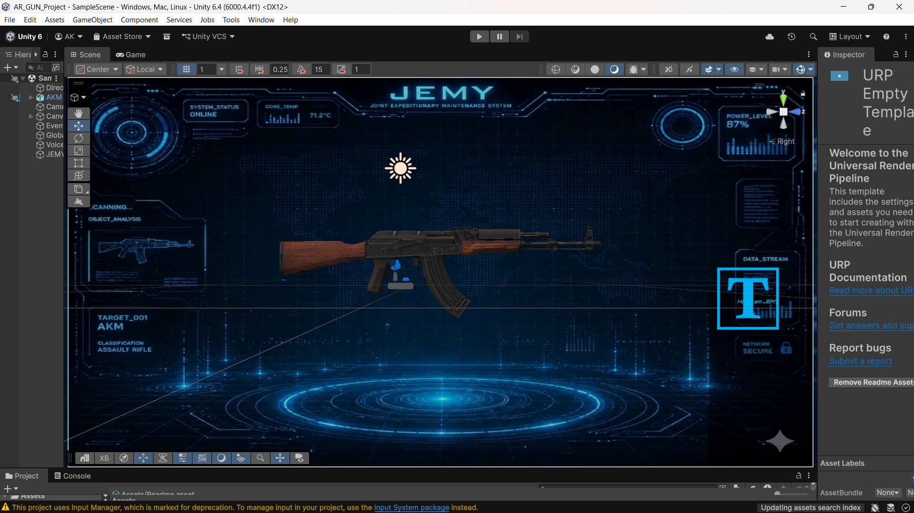
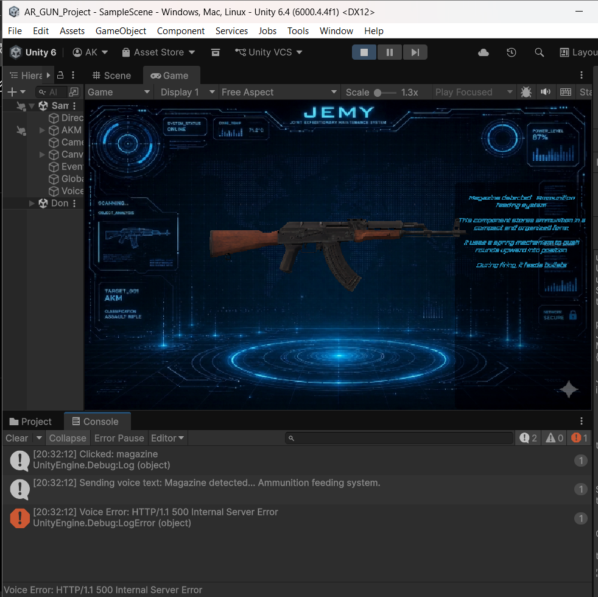

# AR/VR Weapon Learning System

## Overview
The AR/VR Weapon Learning System is an AI-assisted immersive educational project designed to enhance technical understanding through augmented and virtual reality technologies.

The system focuses on interactive weapon visualization, intelligent educational interfaces, and immersive learning experiences for defense technology awareness and future simulation research concepts.

---

## Key Features
- AR-based weapon visualization
- Interactive 3D learning environment
- AI-assisted educational interaction
- Real-time information display panels
- Immersive VR learning concepts
- Technical awareness and visualization system
- User-friendly interface design

---

## Technologies Used
- Unity Engine
- C#
- AR Foundation
- VR Integration
- Blender
- Artificial Intelligence Concepts
- 3D Modeling

---

## Project Modules
- AR Visualization Module
- VR Interaction System
- Information Panel Interface
- 3D Object Rendering
- Educational Awareness System
- AI-Assisted Learning Components

---

## Applications
- AR/VR-based technical education
- Interactive learning systems
- Immersive visualization platforms
- Defense technology awareness
- Intelligent educational simulation
- Future research and training concepts

---

## Future Scope
- Advanced immersive simulations
- AI-powered interaction systems
- Real-time analytics integration
- Voice-assisted AR/VR learning
- Intelligent training environments
- Extended defense-tech research systems

---

## Project Preview

### AR Visualization

### 3D Weapon Model

### Interactive Learning Interface

---
## Project Preview

### AR Weapon Learning Interface

### Weapon Visualization

## Author
Aryan Kamble

AIML Engineering Student | AI, AR/VR & Intelligent Systems Enthusiast
